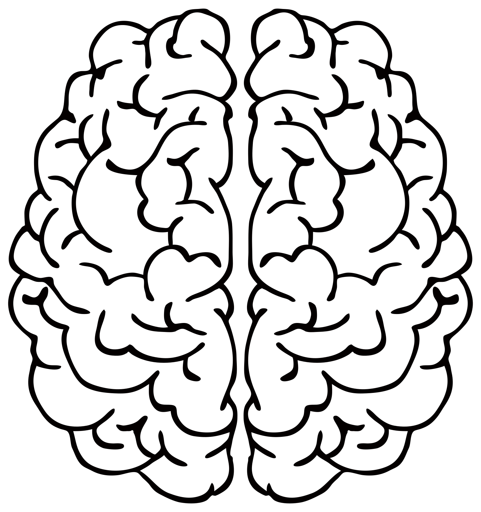
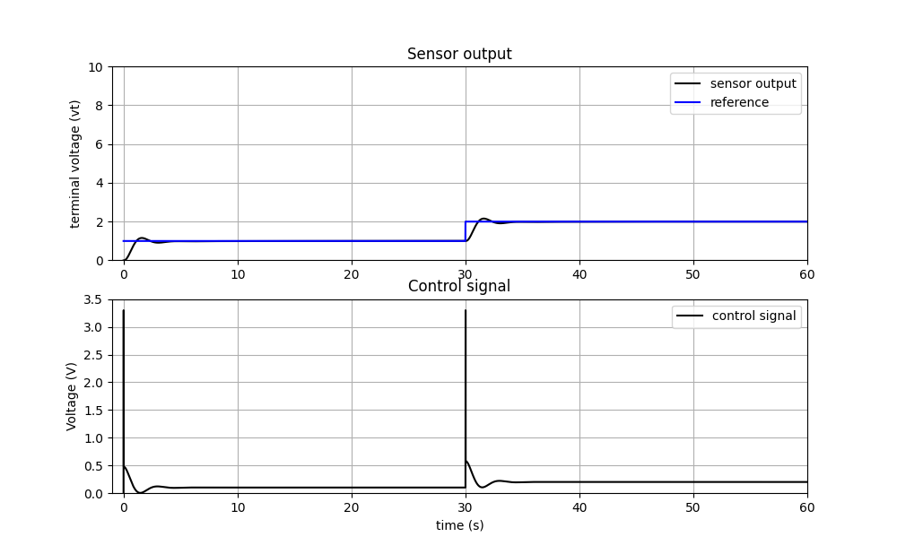
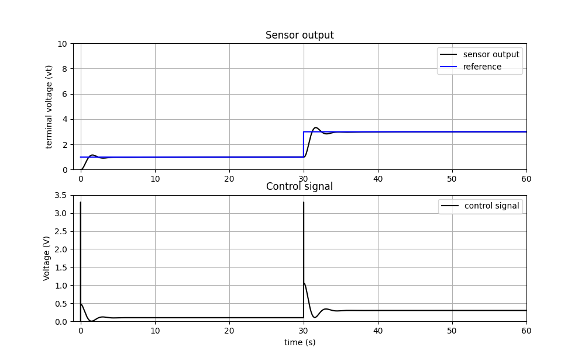
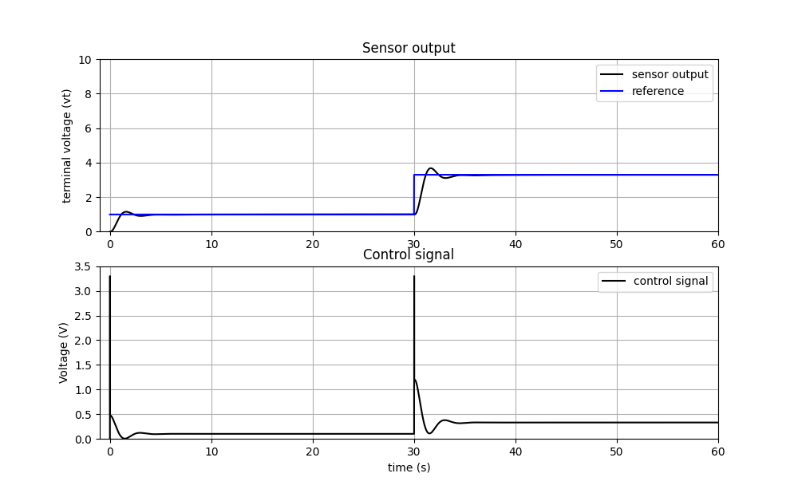
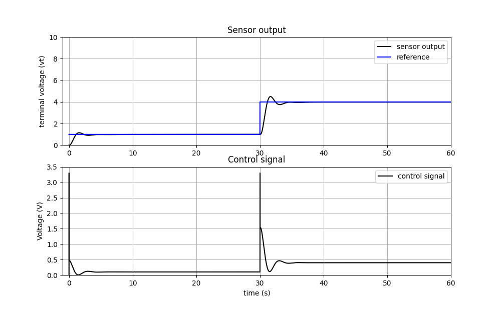
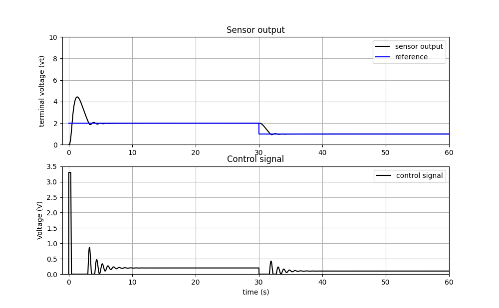

<h1 align="center">
	 
	
	 
	BELBIC
	  
</h1>

	A Python implementation of Braing Emotional Learning Based Intelligent
	Controller (BELBIC) algorithm.

<!-- 

	<a href="">What is?</a> • <a href="">Tech Stack</a> •
	<a href="">Results</a>

 -->

## **What is?**

BELBIC (Brain Emotional Learning Based Intelligent Controller)
is one such controller which is proposed by Caro Lucas, Danial Shahmirzadi and
Nima Sheikholeslami and adopts the network model developed by Moren and
Balkenius to mimic those parts of the brain which are known to produce emotion
(the amygdala, orbitofrontal cortex, thalamus and sensory input cortex).

## **Tech Stack**

- [Python](https://www.python.org/)
- [Numpy](https://numpy.org/)
- [Matplotlib](https://matplotlib.org/)

## **Results**

These results were obtained according to the plant simulation model
implemented in the file, in the directory model.

<h1 align="center">
	
	 
</h1>

<h1 align="center">
	
	 
</h1>

<h1 align="center">
	
	 
</h1>

<h1 align="center">
	
	 
</h1>

<h1 align="center">
	
	 
</h1>

## **Thank you**

Gustavo Pereira da Fonseca  
[TAPIOCA](http://tapioca.eaj.ufrn.br/)
